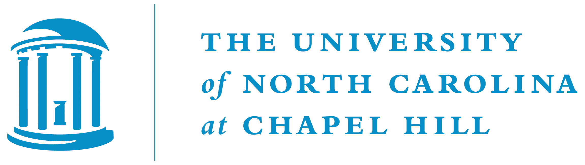

<a href="#register">Register</a> | <a href="#program">Program</a> | <a href="#logistics">Logistics</a>
---
 

# Latin American Political Methodology Meeting, 2021

Welcome! We are excited to announce the fifth Latin American Polmeth (LAPolMeth) meeting. The event will take place on November 19-20, 2021 employing a hybrid format. The in-person section will be hosted by ITAM in Mexico City, but a limited number of attendees from all over the world will be able to join virtually. The event is sponsored by the Society for Political Methodology, Princeton University, and the University of North Carolina at Chapel Hill.

The meeting will feature a limited number of paper workshops, a poster session for graduate students, and keynote talks by prominent political methodologists [Jennifer Larson](https://www.jmlarson.com/) (Vanderbilt) and [Cyrus Samii](https://cyrussamii.com/) (NYU).

## Application process
Aplications are now closed.

## Registrarion
Registration for this event is now closed.

## Program
The final version of the conference program is available [here](https://docs.google.com/document/d/1PgdLx9iwLM0_QdtJYdM9nQTYmqK_S22gaB1ocCvOe88/edit?usp=sharing).

## Logistics

### Event format
The event will feature parallel paper workshops, which will be restricted to registered participants. Participants may attend either personally or virtually. These sessions will consist of active discussions of previously circulated manuscripts; no presentation will take place. It is therefore imperative that all participants read the papers in advance and prepare feedback to ensure a lively and engaging discussion. To enable all participants to engage in productive conversation, authors are expected to submit complete drafts of their manuscripts no later than November 1, 2021. Authors will be provided with information on where to upload their manuscripts upon confirmation of acceptance.

There will be a total of two keynote presentations at the end of each day. These will be open to the public.

The poster session for graduate students will be held at lunchtime on Saturday, November 20.

All talks, posters and sessions will be held in English.

### Meeting location
The meeting will be held at [ITAM's Santa Teresa campus](https://goo.gl/maps/MfN8DvYV2kdp94ic9) in Mexico City, Mexico, on November 19-20, 2021. Registered participants who so desire may attend the event virtually. The Santa Teresa campus is located on [Av. Camino Sta. Teresa #930, Héroes de Padierna, Magdalena Contreras](https://goo.gl/maps/MfN8DvYV2kdp94ic9).

### Transportation from/to the airport
Uber is legal and works perfectly in Mexico City; a trip to and from the Mexico City International Airport to the Condesa/Roma neighborhood typically costs less than US$12, oftentimes much less. You can also hire a cab from one of the stands located immediately outside the Arrivals hall. They all accept credit cards and have predetermined fares depending on the neighborhood you're going to. They may be somewhat more expensive than hiring an Uber, though.

### Lodging
The Condesa/Roma neighborhood is great for walking and dining. ITAM has arranged a special rate with the [Fiesta Inn Insurgentes Viaducto](https://www.fiestainn.com/es/fiesta-inn-insurgentes-viaducto?gclid=CjwKCAjwy7CKBhBMEiwA0Eb7aovvKNqmSkgqR7fVAiH_EeeP5ZtRUleR3yDmunr0-SdwIT6NJ3t6exoCRWoQAvD_BwE&gclsrc=aw.ds), which is located in the area. There is a speacial rate for conference members; just let us know that you plan to reserve here and we'll send you the reservation code. In addition, we will provide transportation to and from this hotel and the Santa Teresa campus.

If you prefer another alternative, the Condesa/Roma neighborhood is full of hotel and AirBnb options. An Uber to and from the Santa Teresa campus generally costs less than US$8.

Alternatively, if you prefer to walk to and from the campus, the [Camino Real Pedregal](https://www.caminoreal.com/en/caminoreal/camino-real-pedregal-mexico) is a good option; it's in front of a shopping center, but note that it is ***not*** in a walkable area.

### Transportation in Mexico City
We will provide transportation to and from the [Fiesta Inn Insurgentes Viaducto](https://www.fiestainn.com/es/fiesta-inn-insurgentes-viaducto?gclid=CjwKCAjwy7CKBhBMEiwA0Eb7aovvKNqmSkgqR7fVAiH_EeeP5ZtRUleR3yDmunr0-SdwIT6NJ3t6exoCRWoQAvD_BwE&gclsrc=aw.ds) and the Santa Teresa campus for all conference members. Participants who reserve on another hotel can either walk to the Fiesta Inn Insurgentes Viaducto and take the bus, or take an Uber or a cab to the conference. Uber works perfectly in Mexico City. It is cheap, safe, can be paid through the regular app, and the city's large size ensures that there are always cars available. Taxis are also generally safe, but typically only accept cash.

### Organizing team
- Adrián Lucardi (ITAM, Mexico)
- Lorena Barberia (Universidade de São Paulo, Brazil)
- Carmen Le Foulon (Centro de Estudios Públicos, Chile)
- John Londregan (Princeton University, USA)
- Santiago López-Cariboni (Universidad de la República, Uruguay)
- Santiago Olivella (University of North Carolina at Chapel Hill, USA)

### Sponsors
   
