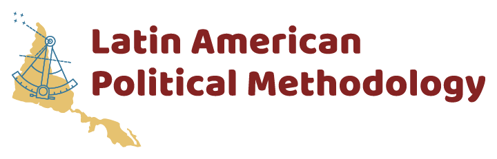

<a href="#register">Register</a> | <a href="#program">Program</a> | <a href="#logistics">Logistics</a>
---
 

# Latin American Political Methodology Meeting, 2021

Welcome! We are excited to announce the fifth Latin American Polmeth (LAPolMeth) meeting. The event will take place on November 19-20, 2021 employing a hybrid format. The in-person section will be hosted by ITAM in Mexico City, but a limited number of attendees from all over the world will be able to join virtually. The event is sponsored by the Society for Political Methodology, Princeton University, and the University of North Carolina at Chapel Hill.

The meeting will feature a limited number of paper workshops, a poster session for graduate students, and keynote talks by prominent political methodologists [Jennifer Larsson](https://www.jmlarson.com/) (Vanderbilt) and [Cyrus Samii](https://cyrussamii.com/) (NYU).

## Application process

The application process will be open through May 31, 2021 **in the following link**. Those interested in attending must indicate paper title, author information, and an abstract not exceeding 250 words. Graduate students must indicate their intention to participate in the poster session.

The organizing team will notify applicants of its decision on June  18, 2021. Applicants will then have the chance to register from June 21 through July 30, 2021. There is a small registration fee ($10 and $20 for student and non-student SPM members; $25 and $50 for non-members, respectively). To ensure that all participants have enough time to read their paper, participants are required to submit their papers no later than October 31, 2021.

## Program

The program will feature:
-	Two keynote presentations, by [Jennifer Larsson](https://www.jmlarson.com/) (Vanderbilt) and [Cyrus Samii](https://cyrussamii.com/) (NYU).
-	Six manuscript workshop sessions by both theoretical and applied methodologists
-	One poster session featuring exciting research by graduate students

A copy of the program will be made available [here](https://docs.google.com/document/d/1IVoHIswSK_iGrF0i71uvQWWBm_rNmKH1qZH-FXxY4KQ/edit?usp=sharing) by mid-September.

## Logistics

### Event format
The event will feature parallel paper workshops, which will be restricted to registered participants. Participants may attend either personally or virtually. These sessions will consist of active discussions of previously circulated manuscripts; no presentation will take place. It is therefore imperative that all participants read the papers in advance and prepare feedback to ensure a lively and engaging discussion. To enable all participants to engage in productive conversation, authors are expected to submit complete drafts of their manuscripts no later than October 31, 2021. Authors will be provided with information on where to upload their manuscripts upon confirmation of acceptance.

There will be a total of two keynote presentations at the end of each day. These will be open to the public.

The poster session for graduate students will be held at lunchtime on Saturday, November 20.

All talks, posters and sessions will be held in English.

### Meeting location
The meeting will be held at ITAM's campus in Mexico City, Mexico, on November 19-20, 2021. Registered participants who so desire may attend the event virtually.

### Organizing team
- Lorena Barberia (Universidade de São Paulo, Brazil)
- Carmen Le Foulon (Centro de Estudios Públicos, Chile)
- John Londregan (Princeton University)
- Santiago López-Cariboni (Universidad de la República, Uruguay)
- Adrián Lucardi (ITAM, Mexico)
- Santiago Olivella (University of North Carolina at Chapel Hill)

### Sponsors
   
